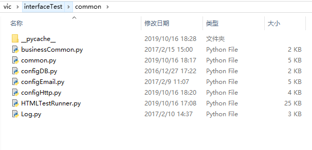
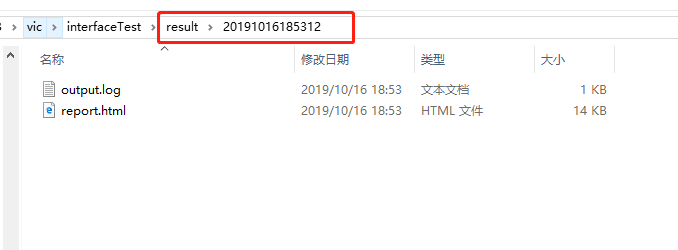

[TOC]


## 目录结构 ##

##### 目录截图 #####


1. **common文件夹存放公用的Python文件**

   

2. **result文件夹存放执行的结果文件**

   

3. **testCase文件夹存放用于执行测试用例的python文件**

   

   

   > *这里放的是用于执行测试用例的python文件*

4. **testFile文件夹存放用于测试的用例，相关的接口配置、数据库配置、邮件模板等**

   

   

   
   
   *case文件夹中放的是以excel存放的测试用例*
   
   
   
   *emailStyle.txt中是设置测试执行完成后通知邮件的格式*
   
   
   
   *interfaceURL.xml设置要测试接口的路径*
   
   
   
   *SQL.xml设置数据库相关操作*

5. **caselist.txt里面设置要执行的用例，签名不带#的执行，带#的不执行**

   

6. **config.ini是接口测试框架的配置文件**

   

7. **readConfig.py文件用于读取config.ini配置**

   

8. **runAll.py是接口的入口文件**

   

   ---

## 运行逻辑

#### 框架运行流程

1. 调用runAll入口文件的run()方法
2. run()调用set_case_suite()方法获取测试用例套件
   1. set_case_suite()方法调用set_case_list()方法设置要执行的用例列表
   2. 调用unittest的TestSuite()方法，初始化一个测试套件，最终将要执行的用例存放到这个套件中
   3. set_case_suite()方法最终返回一个设置好要执行用例的unittest.TestSuite类型的测试套件
3. 利用HTMLTestRunner模块的run()执行上一步获得的测试套件，利用Log模块记录运行日志
4. 根据设置，如果需要则使用configEmail.py模块发送邮件给配置的邮件接收人。

ps：测试用例单独编写存放，参考下面的testLogin.py示例说明

#### 核心文件、类、方法说明

###### 入口文件 -- runAll.py

runAll.py包含方法：\__init__()、set_case_list()、set_case_suite()、run()

- \__init__()：初始化AllTest类；
- set_case_list()：设置要执行的用例，保存到一个列表中；
- set_case_suite()：设置要执行的用例套件（使用unittest的TestSuite），并返回test_suite；
- run()：框架的启动方法，先调用set_case_suite()设置测试套件，通过logger记录日志，通过HTMLTestRunner实例化一个runner运行器，调用runner的run方法，并把测试套件作为参数传给run方法运行测试。

1. 入口文件runAll.py中调用run()方法，在run()方法中先设置测试套件，使用logger记录执行日志，使用HTMLTestRunner()方法定义一个运行器（runner），调用运行器的runner方法，同时将测试套件作为参数传入，执行测试套件中的测试用例；最后根据配置确定是否调用邮件模块将结果发送邮件。

###### 日志记录文件 -- Log.py

Log.py文件用于记录执行日志。主要通过python的logging模块实现的。

```python
class Log:
    def __init__(self):
        global logPath, resultPath, proDir
        proDir = readConfig.proDir
        resultPath = os.path.join(proDir, "result")
        if not os.path.exists(resultPath):
            os.mkdir(resultPath)
        logPath = os.path.join(resultPath, str(datetime.now().strftime("%Y%m%d%H%M%S")))
        if not os.path.exists(logPath):
            os.mkdir(logPath)
        self.logger = logging.getLogger()
        self.logger.setLevel(logging.INFO)

        # defined handler
        handler = logging.FileHandler(os.path.join(logPath, "output.log"))
        # defined formatter
        formatter = logging.Formatter('%(asctime)s - %(name)s - %(levelname)s - %(message)s')
        handler.setFormatter(formatter)
        self.logger.addHandler(handler)

    def get_logger(self):
        """
        get logger
        :return:
        """
        return self.logger

    def build_start_line(self, case_no):
        """
        write start line
        :return:
        """
        self.logger.info("--------" + case_no + " START--------")
   ....
```

通过线程模块threading的Lock()方法防止发生冲突。

```python
class MyLog:
    log = None
    mutex = threading.Lock()

    def __init__(self):
        pass

    @staticmethod
    def get_log():

        if MyLog.log is None:
            MyLog.mutex.acquire()
            MyLog.log = Log()
            MyLog.mutex.release()

        return MyLog.log
```

###### 配置读取模块--readConfig.py

使用os模块处理文件的路径；使用configparser模块处理配置文件。

```python
import os
import codecs
import configparser

proDir = os.path.split(os.path.realpath(__file__))[0]
configPath = os.path.join(proDir, "config.ini")


class ReadConfig:
    def __init__(self):
        fd = open(configPath)
        data = fd.read()

        #  remove BOM
        if data[:3] == codecs.BOM_UTF8:
            data = data[3:]
            file = codecs.open(configPath, "w")
            file.write(data)
            file.close()
        fd.close()

        self.cf = configparser.ConfigParser()
        self.cf.read(configPath)

    def get_email(self, name):
        value = self.cf.get("EMAIL", name)
        return value

    def get_http(self, name):
        value = self.cf.get("HTTP", name)
        return value

    def get_headers(self, name):
        value = self.cf.get("HEADERS", name)
        return value
    ....
```

###### 测试用例执行器--HTMLTestRunner.py

HTMLTestRunner是一个类似于TextTestRunner的python unittest模块的扩展。第一个参数fp是报告文件report.html，第二个参数是标题，第三个参数是描述


###### 发送邮件模块--configEmail.py

利用Python的smtplib、email等模块实现邮件发送


###### 测试用例--testLogin.py（示例说明）

利用unittest的参数化模块paramunittest.parametrized，将编写好的测试用例要测试的不同参数保存在excel中，作为参数传递给测试类，在类中初始化传递的参数并使用

```python
import unittest
import paramunittest
import readConfig as readConfig
from common import Log as Log
from common import common
from common import configHttp as ConfigHttp

login_xls = common.get_xls("userCase.xlsx", "login")
localReadConfig = readConfig.ReadConfig()
configHttp = ConfigHttp.ConfigHttp()
info = {}

@paramunittest.parametrized(*login_xls)
class Login(unittest.TestCase):
    def setParameters(self, case_name, method, token, email, password, result, code, msg):
        """
        set params
        :param case_name:
        :param method:
        :param token:
        :param email:
        :param password:
        :param result:
        :param code:
        :param msg:
        :return:
        """
        self.case_name = str(case_name)
        self.method = str(method)
        self.token = str(token)
        self.email = str(email)
        self.password = str(password)
        self.result = str(result)
        self.code = str(code)
        self.msg = str(msg)
        self.return_json = None
        self.info = None

    def description(self):
        """
        test report description
        :return:
        """
        self.case_name

    def setUp(self):
        """
        :return:
        """
        self.log = Log.MyLog.get_log()
        self.logger = self.log.get_logger()
        print(self.case_name+"测试开始前准备")

    def testLogin(self):
        """
        test body
        :return:
        """
        # set url
        self.url = common.get_url_from_xml('login')
        configHttp.set_url(self.url)
        print("第一步：设置url  "+self.url)

        # get visitor token
        if self.token == '0':
            token = localReadConfig.get_headers("token_v")
        elif self.token == '1':
            token = None

        # set headers
        header = {"token": str(token)}
        configHttp.set_headers(header)
        print("第二步：设置header(token等)")

        # set params
        data = {"email": self.email, "password": self.password}
        configHttp.set_data(data)
        print("第三步：设置发送请求的参数\n\t\t"+str(data))

        # test interface
        self.return_json = configHttp.post()
        method = str(self.return_json.request)[int(str(self.return_json.request).find('['))+1:int(str(self.return_json.request).find(']'))]
        print("第四步：发送请求\n\t\t请求方法："+method)

        # check result
        self.checkResult()
        print("第五步：检查结果")

    def tearDown(self):
        """

        :return:
        """
        info = self.info
        if info['code'] == 0:
            # get uer token
            token_u = common.get_value_from_return_json(info, 'member', 'token')
            # set user token to config file
            localReadConfig.set_headers("TOKEN_U", token_u)
        else:
            pass
        self.log.build_case_line(self.case_name, str(self.info['code']), self.info['msg'])
        print("测试结束，输出log完结\n\n")

    def checkResult(self):
        """
        check test result
        :return:
        """
        print(self.return_json)
        self.info = self.return_json.json()
        # show return message
        common.show_return_msg(self.return_json)

        if self.result == '0':
            email = common.get_value_from_return_json(self.info, 'member', 'email')
            self.assertEqual(self.info['code'], self.code)
            self.assertEqual(self.info['msg'], self.msg)
            self.assertEqual(email, self.email)

        if self.result == '1':
            self.assertEqual(str(self.info['code']), self.code)
            self.assertEqual(self.info['msg'], self.msg)
```

